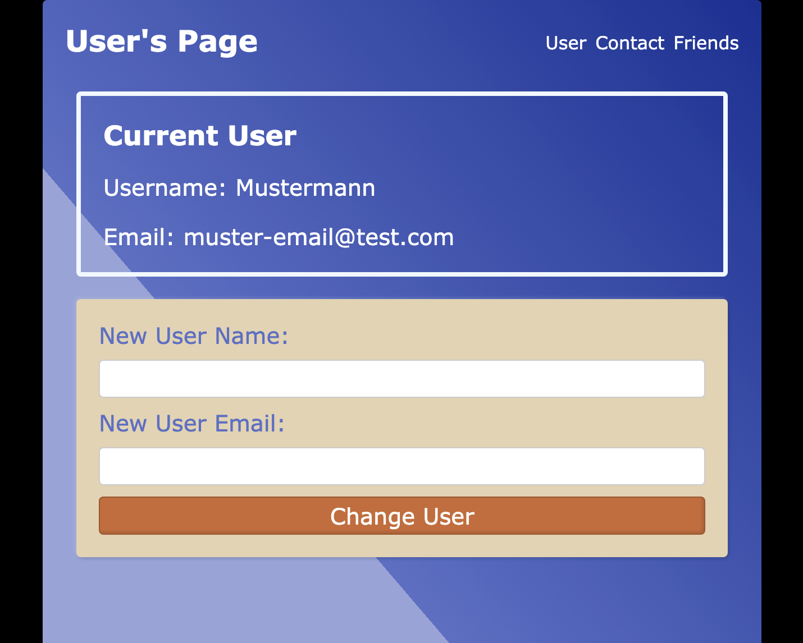

# User Page

A simple React application to practice Context API, useEffect, useState, Fetch API, useRef and React Router.



## Project Overview

This React application provides a simple user interface with the following features:
- Display and modify user information
- Contact form with validation
- Display a friends list retrieved from the JSONPlaceholder API

The project serves as a practical example for modern React concepts and hooks.

## Main Features

- **Context API**: Global state management with `userContext`
- **useState**: Component state management
- **useEffect**: Data fetching and side effects
- **useRef**: DOM manipulation and persistent values between renders
- **React Router**: Navigation between different components
- **Fetch API**: Retrieve external data from JSONPlaceholder

## Technologies

- React 18.3.1
- React Router DOM 7.0.2
- Vite 6.0.1 as build tool
- ESLint for code quality

## Project Structure

```
user-page/
├── public/
│   └── vite.svg
├── src/
│   ├── App.css               # Main application styling
│   ├── App.jsx               # Main app component with context
│   ├── LayoutPage.jsx        # Layout with navigation and outlet
│   ├── appRouter.jsx         # Router configuration
│   ├── components/
│   │   ├── ContactForm.jsx   # Form with validation
│   │   ├── DisplayUser.jsx   # User display component
│   │   ├── FriendsList.jsx   # Fetch and display friends data
│   │   └── NotFound.jsx      # 404 error page
│   ├── index.css             # Basic CSS styles
│   └── main.jsx              # Application entry point
└── vite.config.js            # Vite configuration
```

## Usage

The application consists of three main pages:

1. **User**: Displays the current user and allows changing user data
2. **Contact**: A form for submitting contact information
3. **Friends**: Shows a list of users retrieved from the JSONPlaceholder API